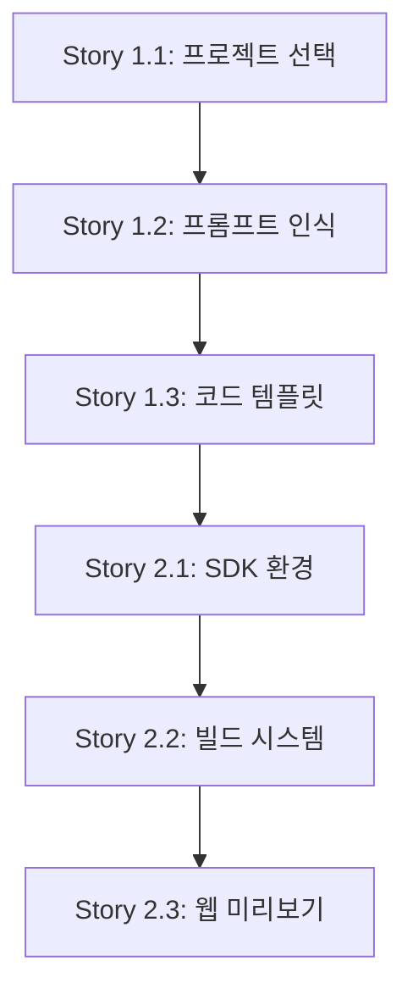

# Flutter 확장 프로젝트 로드맵

**프로젝트**: Open Lovable Flutter 확장  
**작성일**: 2025-08-30  
**작성자**: Mary (비즈니스 분석가)

---

## 🎯 프로젝트 개발 로드맵

### Phase 1: 기반 구축 (6-8주)
**목표**: Flutter 코드 생성과 실행 환경의 최소 기능 구현

#### Week 1-2: 프로젝트 선택 및 의도 분석
- ✅ **Story 1.1**: Flutter 프로젝트 타입 선택 (3SP)
- ✅ **Story 1.2**: Flutter 프롬프트 패턴 인식 (5SP)

#### Week 3-4: 코드 생성 엔진
- ✅ **Story 1.3**: Dart/Flutter 코드 템플릿 시스템 (8SP)

#### Week 5-6: Flutter 실행 환경
- ✅ **Story 2.1**: Flutter SDK 샌드박스 환경 구성 (13SP)

#### Week 7-8: 빌드 및 미리보기
- ✅ **Story 2.2**: Flutter 프로젝트 빌드 시스템 (8SP)  
- ✅ **Story 2.3**: Flutter 웹 미리보기 (8SP)

**Phase 1 결과물**: 기본적인 Flutter 앱 생성 및 실행이 가능한 MVP

---

### Phase 2: 사용자 경험 완성 (4-5주)
**목표**: 통합 UI와 고품질 코드 생성으로 사용자 경험 개선

#### Week 9-10: UI 통합 및 개선
- ✅ **Story 3.1**: 프로젝트 타입 전환 UI (5SP)
- ✅ **Story 3.2**: 플랫폼별 미리보기 통합 (8SP)

#### Week 11-12: 코드 품질 향상
- ✅ **Story 1.4**: Flutter AI 프롬프트 최적화 (8SP)
- ✅ **Story 1.5**: Flutter 코드 스트리밍 적용 (5SP)

#### Week 13: 패키지 관리
- ✅ **Story 2.4**: 패키지 의존성 관리 (8SP)

**Phase 2 결과물**: 완전한 Flutter 개발 플랫폼으로 베타 출시 가능

---

### Phase 3: 고도화 (5-6주)
**목표**: Flutter 생태계 특화 기능과 고급 개발 패턴 지원

#### Week 14-16: 모바일 특화 기능
- ✅ **Story 4.1**: 모바일 UI 패턴 인식 (13SP)

#### Week 17-19: 고급 개발 패턴
- ✅ **Story 4.2**: 상태 관리 패턴 자동 적용 (13SP)

**Phase 3 결과물**: 엔터프라이즈급 Flutter 개발 플랫폼

---

## 📊 의존성 매트릭스

### 🔴 Critical Path (반드시 순차적으로 진행)

### 🟡 Independent (병렬 개발 가능)

| Story | 의존성 | 병렬 가능 |
|-------|--------|-----------|
| Story 1.4 | Story 1.3 완료 후 | Story 1.5와 병렬 |
| Story 1.5 | Story 1.3 완료 후 | Story 1.4와 병렬 |
| Story 2.4 | Story 2.2 완료 후 | 독립적 |
| Story 3.1 | Story 1.1 완료 후 | Story 3.2와 병렬 |
| Story 3.2 | Story 2.3 완료 후 | Story 3.1과 병렬 |

### 🟢 Optional (우선순위 낮음)

| Story | 선행 조건 | 개발 시점 |
|-------|-----------|-----------|
| Story 4.1 | Phase 1 완료 후 | Phase 3 |
| Story 4.2 | Story 4.1 완료 후 | Phase 3 |

---

## ⚠️ 리스크 및 완화 전략

### 높은 리스크 영역

#### 1. Flutter SDK 샌드박스 통합 (Story 2.1)
**리스크**: E2B 환경에서 Flutter SDK 설치 실패 또는 성능 이슈
**완화 전략**:
- 사전 기술 스파이크를 통한 검증 (1-2일)
- Docker 컨테이너 기반 백업 플랜 준비
- Flutter 웹 버전 우선 개발로 리스크 최소화

#### 2. AI 모델의 Flutter 코드 품질 (Story 1.4)
**리스크**: 생성된 Flutter 코드가 실행 불가능하거나 모범 사례를 벗어남
**완화 전략**:
- Flutter 전문가와의 프롬프트 엔지니어링 협업
- 코드 검증 및 자동 수정 시스템 구축
- 단계적 템플릿 확장 (기본 → 중급 → 고급)

### 중간 리스크 영역

#### 3. 성능 최적화 (Story 2.3, 3.2)
**리스크**: Flutter 웹 미리보기 성능 저하로 사용자 경험 악화
**완화 전략**:
- 미리보기 렌더링 최적화
- 필요시 iframe 격리 방식 도입
- 사용자별 성능 설정 옵션 제공

---

## 📈 성공 지표 및 검증 계획

### Phase 1 검증 지표
- [ ] Flutter 앱 생성 성공률 > 85%
- [ ] 코드 생성 응답 시간 < 10초
- [ ] 빌드 성공률 > 90%
- [ ] 웹 미리보기 로딩 시간 < 5초

### Phase 2 검증 지표  
- [ ] 사용자 만족도 > 4.0/5.0
- [ ] 프로젝트 전환 성공률 > 95%
- [ ] 코드 품질 점수 > 80점 (린팅 기준)
- [ ] 실시간 스트리밍 지연시간 < 2초

### Phase 3 검증 지표
- [ ] 복잡한 UI 패턴 생성 성공률 > 80%
- [ ] 상태 관리 패턴 적용률 > 90%
- [ ] 패키지 자동 설치 성공률 > 95%

---

## 🚀 출시 전략

### MVP 출시 (Phase 1 완료 후)
- **대상**: 얼리 어답터 개발자 100명
- **피드백 수집**: 2주간 베타 테스트
- **핵심 기능**: 기본 Flutter 앱 생성 및 실행

### 베타 출시 (Phase 2 완료 후)  
- **대상**: Flutter 커뮤니티 및 기존 사용자
- **마케팅**: Flutter 컨퍼런스 및 개발자 커뮤니티
- **목표**: 월간 활성 사용자 1,000명

### 정식 출시 (Phase 3 완료 후)
- **대상**: 전체 모바일 앱 개발자 시장
- **차별화 포인트**: AI 기반 크로스 플랫폼 개발 도구
- **목표**: 월간 활성 사용자 10,000명

---

## 💡 추가 개선 아이디어 (백로그)

### 단기 (3-6개월)
- iOS 시뮬레이터 통합
- Android 에뮬레이터 지원
- Firebase 자동 연동
- 상태 관리 라이브러리 선택 옵션

### 중기 (6-12개월)
- Flutter 패키지 마켓플레이스 통합
- 디자인 시스템 자동 적용
- API 연동 코드 자동 생성
- 테스트 코드 자동 생성

### 장기 (12-24개월)
- 네이티브 iOS/Android 개발 지원
- 팀 협업 기능 
- 버전 관리 및 배포 자동화
- 하이브리드 앱 개발 지원

---

*이 로드맵은 시장 피드백과 기술 발전에 따라 유연하게 조정됩니다.*