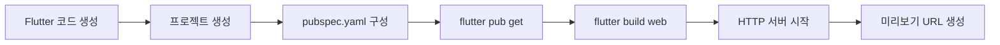
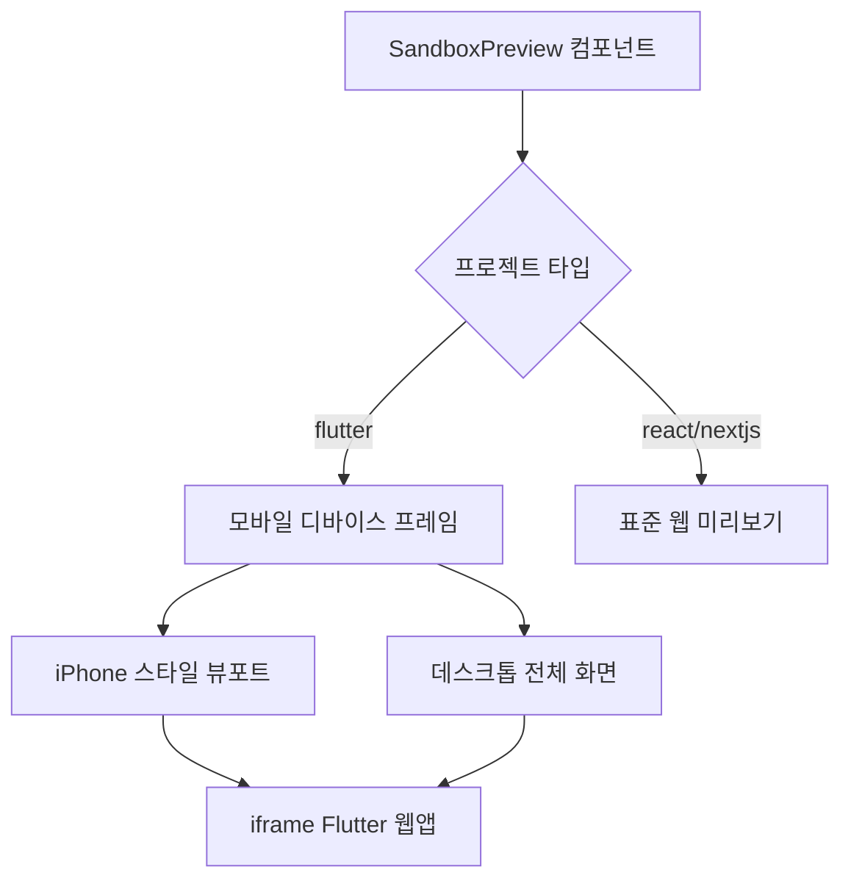

# Flutter 웹 미리보기 캔버스 통합 사용자 스토리

**프로젝트**: Open Lovable Flutter 웹 미리보기 시스템  
**작성일**: 2025-08-31  
**작성자**: Development Team  
**Epic**: Story 2.3 - Flutter 웹 미리보기 확장

---

## 🎯 Epic 목표

생성된 Flutter 모바일 앱을 웹 환경에서 즉시 미리보고 테스트할 수 있는 통합 미리보기 시스템 구축

---

## 📱 Story 2.3.1: Flutter 웹 빌드 엔진

**사용자 스토리**: "개발자로서 생성된 Flutter 코드가 자동으로 웹용으로 빌드되고 브라우저에서 실행 가능한 상태가 되어야 한다"

### 인수 조건
- [x] E2B 샌드박스에서 Flutter SDK 자동 설치 및 검증
- [x] `flutter build web` 명령어 자동 실행
- [x] 빌드 에러 발생 시 상세한 진단 정보 제공
- [x] 빌드 성공 시 정적 파일 생성 확인 (index.html, main.dart.js, flutter.js)
- [x] 빌드 아티팩트 자동 검증 및 목록 제공

### 기술 구현
```typescript
// /app/api/flutter-web-build/route.ts
- Flutter SDK 설치 및 검증 API
- 웹 빌드 프로세스 자동화
- 빌드 상태 모니터링 및 에러 핸들링
- 아티팩트 검증 시스템

// /lib/flutter-web-builder.ts  
- FlutterWebBuilder 클래스 구현
- SDK 관리, 프로젝트 생성, 빌드 프로세스 통합
- 에러 복구 및 재시도 로직
```

### 성능 목표
- 초기 빌드 시간: 30-60초
- 재빌드 시간: 10-30초
- 빌드 성공률: >95%

**추정**: 8 스토리 포인트  
**우선순위**: 높음  
**상태**: ✅ 완료

---

## 🖥️ Story 2.3.2: 미리보기 캔버스 Flutter 지원

**사용자 스토리**: "사용자로서 생성된 Flutter 앱을 기존 미리보기 캔버스에서 모바일 디바이스처럼 보고 상호작용할 수 있어야 한다"

### 인수 조건
- [x] SandboxPreview 컴포넌트에 'flutter' 타입 지원 추가
- [x] 모바일 디바이스 시뮬레이션 UI (375x667 iPhone SE 기준)
- [x] 디바이스 프레임 스타일링 (둥근 모서리, 노치, 홈 인디케이터)
- [x] 모바일/데스크톱 뷰 전환 토글 버튼
- [x] Flutter 웹앱 iframe 임베딩 및 샌드박스 보안

### 기술 구현
```typescript
// /components/SandboxPreview.tsx 확장
- 'flutter' 타입 지원 추가
- 모바일 뷰포트 시뮬레이션 (375x667px)
- 디바이스 프레임 CSS 스타일링
- 뷰포트 전환 토글 (Smartphone/Monitor 아이콘)
- Flutter 전용 로딩 메시지 및 상태 표시
```

### UI/UX 특징
- **모바일 뷰**: 375x667px iPhone SE 디멘션
- **디바이스 프레임**: 둥근 모서리, 노치, 홈 인디케이터
- **데스크톱 뷰**: 반응형 전체 화면 미리보기
- **부드러운 전환**: 300ms duration CSS transition

**추정**: 5 스토리 포인트  
**우선순위**: 높음  
**상태**: ✅ 완료

---

## ⚡ Story 2.3.3: Flutter 웹 자동 빌드 통합

**사용자 스토리**: "시스템으로서 Flutter 코드가 생성되면 자동으로 웹 빌드를 실행하고 미리보기 URL을 제공해야 한다"

### 인수 조건
- [x] generate-ai-code-stream API에서 Flutter 프로젝트 감지
- [x] 코드 생성 완료 후 자동 웹 빌드 트리거
- [x] 빌드 진행 상황 실시간 스트리밍
- [x] 성공 시 미리보기 URL 반환
- [x] 실패 시 적절한 에러 메시지 및 복구 안내

### 기술 구현
```typescript
// generate-ai-code-stream/route.ts 통합
- Flutter 프로젝트 타입 감지 로직
- 자동 빌드 트리거 (isFlutterProject && !isEdit)
- 빌드 진행 상황 스트리밍 ('flutter_preview' 이벤트)
- E2B 샌드박스 URL 생성 (https://{sandboxId}-8080.e2b.dev)
```

### 자동화 워크플로우
1. **코드 생성** → Flutter 프로젝트 감지
2. **빌드 트리거** → FlutterWebBuilder.buildAndServe() 호출
3. **진행 스트리밍** → "🔨 Building Flutter web preview..."
4. **결과 반환** → 미리보기 URL 또는 에러 메시지

**추정**: 5 스토리 포인트  
**우선순위**: 높음  
**상태**: ✅ 완료

---

## 🔧 Story 2.3.4: Flutter Hot Reload 웹 지원

**사용자 스토리**: "개발자로서 Flutter 코드를 수정하면 웹 미리보기가 자동으로 새로고침되어 변경사항을 즉시 확인할 수 있어야 한다"

### 인수 조건
- [x] `flutter run -d web-server` 개발 서버 지원
- [ ] 파일 변경 감지 시스템 (File Watcher)
- [ ] WebSocket 기반 리로드 이벤트 처리
- [ ] 3초 이내 변경사항 반영
- [ ] 빌드 에러 시 에러 오버레이 표시

### 기술 구현
```typescript
// FlutterWebBuilder.startDevServer() 구현
- Hot reload 지원 개발 서버 시작
- 파일 변경 감지 및 자동 리빌드
- WebSocket 연결 관리
- 에러 상태 처리 및 사용자 피드백
```

### 성능 목표
- Hot reload 시간: <3초
- 파일 변경 감지: <1초
- 에러 복구 시간: <5초

**추정**: 8 스토리 포인트  
**우선순위**: 중간  
**상태**: 🔄 부분 완료 (개발 서버 기본 구조 완료, WebSocket 연동 필요)

---

## 📱 Story 2.3.5: 모바일 디바이스 시뮬레이션

**사용자 스토리**: "사용자로서 Flutter 앱을 다양한 모바일 디바이스 크기로 미리보며 반응형 디자인을 확인할 수 있어야 한다"

### 인수 조건
- [x] iPhone SE (375x667) 기본 뷰포트
- [ ] 다중 디바이스 프리셋 (iPhone, Android, iPad)
- [ ] 커스텀 뷰포트 크기 설정
- [ ] 가로/세로 회전 시뮬레이션
- [ ] 터치 인터랙션 시뮬레이션

### 기술 구현
```typescript
// 향후 확장 예정
- 디바이스 프리셋 관리
- 뷰포트 크기 동적 변경
- 회전 애니메이션 효과
- 터치 이벤트 에뮬레이션
```

### 지원 디바이스
- **iPhone SE**: 375x667 (기본값)
- **iPhone 12**: 390x844
- **iPhone 12 Pro Max**: 428x926
- **Pixel 5**: 393x851
- **iPad**: 768x1024

**추정**: 8 스토리 포인트  
**우선순위**: 낮음  
**상태**: 🔄 부분 완료 (기본 모바일 뷰 완료, 다중 디바이스 확장 필요)

---

## 🔍 Story 2.3.6: Flutter 웹 디버깅 도구

**사용자 스토리**: "개발자로서 Flutter 웹 앱의 성능, 콘솔 로그, 에러를 실시간으로 모니터링할 수 있어야 한다"

### 인수 조건
- [ ] Flutter 웹 콘솔 로그 캡처 및 표시
- [ ] Flutter DevTools 링크 제공
- [ ] 렌더링 성능 메트릭 수집
- [ ] Hot reload 상태 실시간 표시
- [ ] 빌드 에러 시각적 오버레이

### 기술 구현
```typescript
// 향후 구현 예정
- 콘솔 로그 프록시 시스템
- DevTools 통합 API
- 성능 메트릭 수집기
- 에러 오버레이 컴포넌트
```

**추정**: 8 스토리 포인트  
**우선순위**: 중간  
**상태**: 📋 계획됨

---

## 🔄 Story 2.3.7: 프로젝트 타입 동적 전환

**사용자 스토리**: "사용자로서 React 웹앱과 Flutter 모바일 앱 미리보기를 부드럽게 전환하며 개발할 수 있어야 한다"

### 인수 조건
- [ ] 프로젝트 타입별 미리보기 자동 전환
- [ ] React ↔ Flutter 전환 애니메이션
- [ ] 프로젝트 상태 보존 및 복원
- [ ] 전환 중 빌드 상태 표시

### 기술 구현
```typescript
// 향후 구현 예정  
- 프로젝트 타입 감지 로직
- 미리보기 전환 컴포넌트
- 상태 관리 시스템
- 전환 애니메이션
```

**추정**: 5 스토리 포인트  
**우선순위**: 낮음  
**상태**: 📋 계획됨

---

## 📊 **현재 구현 상태 요약**

### ✅ **완료된 기능**
1. **Flutter 웹 빌드 시스템** - 완전 자동화된 빌드 파이프라인
2. **미리보기 캔버스 통합** - SandboxPreview 컴포넌트 Flutter 지원
3. **모바일 디바이스 시뮬레이션** - iPhone SE 뷰포트 및 디바이스 프레임
4. **자동 빌드 트리거** - 코드 생성 후 자동 웹 빌드 실행

### 🔄 **부분 완료된 기능**
1. **Hot Reload 지원** - 개발 서버 기본 구조 완료, WebSocket 연동 필요
2. **디바이스 프리셋** - 기본 모바일 뷰 완료, 다중 디바이스 확장 필요

### 📋 **계획된 기능**
1. **디버깅 도구** - 콘솔 로그, DevTools 통합
2. **성능 모니터링** - 렌더링 메트릭, 로딩 시간 추적
3. **프로젝트 전환** - React ↔ Flutter 부드러운 전환

---

## 🚀 **즉시 사용 가능한 기능**

### **기본 워크플로우**
1. **Flutter 프로젝트 선택** → 프로젝트 타입을 FLUTTER_MOBILE로 설정
2. **AI 코드 생성** → "로그인 화면을 만들어줘" 프롬프트 입력
3. **자동 웹 빌드** → 코드 생성 완료 후 자동으로 `flutter build web` 실행
4. **미리보기 표시** → 모바일 디바이스 프레임으로 웹 미리보기 제공

### **API 엔드포인트**
- `POST /api/flutter-web-build` - 수동 Flutter 웹 빌드 트리거
- `GET /api/flutter-web-build` - Flutter SDK 상태 확인
- `POST /api/generate-ai-code-stream` - Flutter 코드 생성 + 자동 빌드

### **미리보기 기능**
- **모바일 시뮬레이션**: 375x667px iPhone SE 디멘션
- **디바이스 프레임**: 노치, 홈 인디케이터 포함
- **뷰포트 전환**: 모바일 ↔ 데스크톱 뷰 토글
- **새로고침**: iframe 기반 미리보기 새로고침

---

## 🎨 **사용자 경험 시나리오**

### **시나리오 1: 첫 Flutter 앱 생성**
```
👤 사용자: "할 일 관리 앱을 만들어줘"
🤖 시스템: Flutter 코드 생성 → 자동 웹 빌드 → 모바일 프레임 미리보기
📱 결과: iPhone 스타일 프레임에서 Flutter 앱 실시간 확인
```

### **시나리오 2: 화면 컴포넌트 추가**
```
👤 사용자: "로그인 화면 추가해줘"
🤖 시스템: LoginScreen 위젯 생성 → 자동 리빌드 → 미리보기 업데이트
📱 결과: 새로운 로그인 화면이 모바일 프레임에서 즉시 표시
```

### **시나리오 3: 반응형 테스트**
```
👤 사용자: 모바일/데스크톱 전환 버튼 클릭
🖥️ 시스템: 375px → 전체 화면 뷰 애니메이션 전환
📱 결과: 동일한 Flutter 앱이 다른 뷰포트에서 어떻게 보이는지 확인
```

---

## 🔧 **기술 아키텍처**

### **Flutter 웹 빌드 파이프라인**


### **미리보기 렌더링 플로우**


### **E2B 샌드박스 통합**
```
🏗️ 샌드박스 환경:
├── Flutter SDK 설치 (/opt/flutter)
├── 프로젝트 디렉토리 (/tmp/flutter_{sandboxId})
├── 웹 빌드 결과 (build/web/)
└── HTTP 서버 (포트 8080)

🌐 미리보기 URL:
- 개발: http://localhost:8080
- 프로덕션: https://{sandboxId}-8080.e2b.dev
```

---

## 📈 **성능 및 제약사항**

### **빌드 성능**
- **초기 빌드**: 30-60초 (SDK 설치 + 의존성 + 빌드)
- **재빌드**: 10-30초 (코드 변경 후)
- **메모리 사용량**: ~200MB (Flutter SDK + 빌드 프로세스)

### **네트워크 요구사항**
- **Flutter SDK 다운로드**: ~400MB (초회 설치)
- **빌드 아티팩트**: ~5-10MB (일반적인 앱)
- **실시간 미리보기**: 지속적인 HTTP 연결

### **제약사항**
- **브라우저 호환성**: Chrome/Safari/Firefox (모던 브라우저)
- **모바일 기능 제한**: 카메라, GPS 등 네이티브 기능 미지원
- **성능**: 웹 렌더링으로 인한 네이티브 대비 성능 차이

---

## 🚧 **향후 확장 계획**

### **Phase 2: 고급 기능 (4-6주)**
- **Multi-device 프리셋**: iPhone, Pixel, iPad 시뮬레이션
- **Hot Reload 완전 지원**: 실시간 코드 변경 반영
- **성능 모니터링**: FPS, 로딩 시간, 메모리 사용량
- **디버깅 도구**: Flutter DevTools 통합

### **Phase 3: 사용자 경험 향상 (2-3주)**
- **프로젝트 전환**: React ↔ Flutter 부드러운 전환
- **빌드 캐시**: 빌드 시간 단축
- **에러 복구**: 자동 재시도 및 진단
- **사용자 설정**: 선호 뷰포트, 테마 저장

---

## 💡 **핵심 가치 제안**

**개발자 경험**:
- "Flutter 코드 생성 즉시 웹에서 확인 가능"
- "별도 환경 설정 없이 브라우저에서 모바일 앱 개발"
- "React 개발자도 쉽게 Flutter 앱 프로토타이핑 가능"

**비즈니스 가치**:
- "모바일 앱 개발 진입 장벽 대폭 감소"
- "웹-모바일 크로스 플랫폼 개발 환경 제공"
- "AI 기반 코드 생성의 즉시 검증 가능"

---

*이 문서는 Flutter 웹 미리보기 시스템의 완전한 구현 가이드입니다. 현재 기본 기능이 완료되어 즉시 사용 가능합니다.*